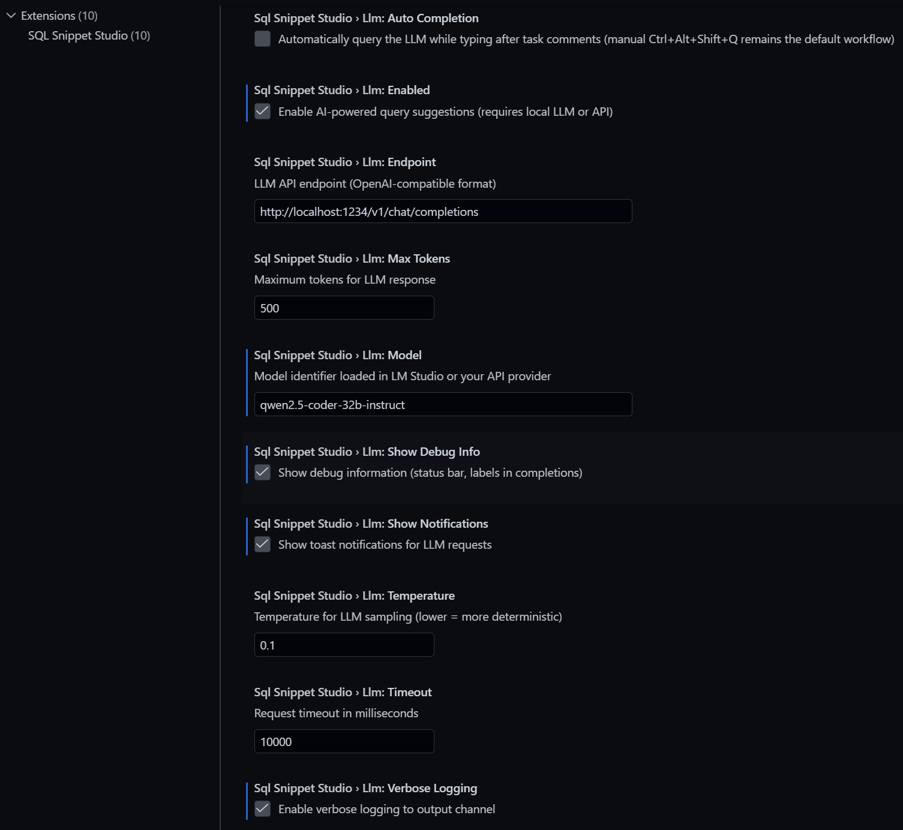
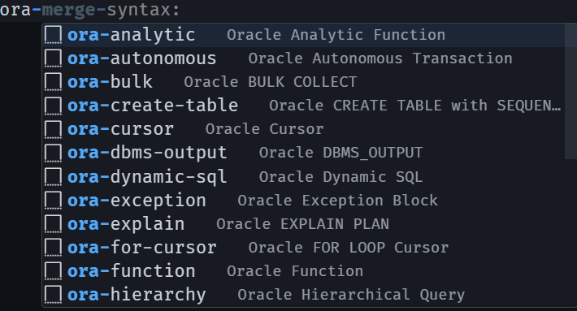

<div align="center">

# ${\Huge{\color{royalblue}{\texttt{SQL Snippet Studio}}}}$ <hr> $\tiny{^{\texttt{Cursor / VS Code extension}}}$

<br><br>
</div>

> ##### *Offline SQL **snippets** and **IntelliSense** for PostgreSQL and Oracle PL/SQL in **Cursor** and **VS Code**, with **optional local LLM assistance**.*

## Features

- **67 snippets** — PostgreSQL (22), Oracle PL/SQL (25), shared SQL patterns (20)
- **Star-schema templates** — dimension tables, fact tables, and complete schemas
- **Fully offline core** — snippets work without network access
- **Optional local LLM** — manual `Ctrl+Alt+Shift+Q` workflow with secure token storage
- **Snippet export** — copy bundled snippet JSON to a folder for sharing


---

### Local LLM Demo (LM Studio)

Slowed for demonstration (real-time speed at the end).

<div align="center">

<table>
  <td width="700">
    
  https://github.com/user-attachments/assets/8e90047e-3ec5-4d69-9717-848a066f709f

  </td>
</table>
  
</div>

---

## In the IDE (Cursor & VS Code)

### Settings

<details>
  <summary><small>show</small> <u>Settings</u> & <u>Token configuration</u></summary>

<small>

> *Search **SQL Snippet Studio** in editor settings*  
>  
> &nbsp;⚠️ &nbsp; &nbsp; **API tokens**  
> &nbsp; &nbsp; &nbsp; &nbsp; &nbsp; &nbsp; are stored through <kbd>> SQL: Set LLM API Token</kbd>,  
> &nbsp; &nbsp; &nbsp; &nbsp; &nbsp; &nbsp; *not* as plain text in `settings.json`.  

</small>

<div align="center">
  
</div>

</details>

### Oracle snippet IntelliSense

Type an Oracle prefix (for example `ora-`) in `.sql` or `.plsql` file to open the snippet picker.

<details>
  <summary><small>show</small> Oracle snippets <u>dropdown example</u></summary>

<div align="center">
  
</div>

</details>

## Full Snippet catalog <sup><small> ${{\scriptsize\boxed{\texttt{67}}}} $</small></sup>

Type a prefix and press **Tab**.

<div style="text-align: left; margin-left: 5rem; width: 66%;">

<blockquote class="info">

ℹ️ &nbsp; &nbsp; **Full reference**: [Snippet_Guide.md](docs/guides/snippet_reference.md)

</blockquote>

</div>

### Shared SQL and dimensional modeling <sup><small> ${{\scriptsize\boxed{\texttt{20}}}} $</small></sup>

<div style="text-align: left; margin-left: 5rem;">

<details>
<summary><small>show</small> All <u>Shared SQL & dimensional modeling</u> snippets</summary>

| Prefix | Description |
| -----: | ----------- |
| `star-schema` | Complete Star Schema with dimensions and fact table |
| `dim-table` | Dimension table with SCD Type 2 support |
| `fact-table` | Fact table with measures and FK references |
| `dim-time` | Standard time dimension table |
| `create-table` | CREATE TABLE with common constraints |
| `fk` | Foreign key constraint |
| `view-analytics` | Analytical view with aggregations |
| `idx-fk` | Index on foreign key column for performance |
| `sel` | Simple SELECT statement |
| `sel-join` | JOIN query with aliases |
| `sel-agg` | Aggregate query with GROUP BY and HAVING |
| `sel-sub` | SELECT with subquery |
| `sel-window` | Query with window function |
| `case` | CASE statement |
| `with-cte` | Common Table Expression (WITH clause) |
| `ins` | INSERT statement |
| `upd` | UPDATE statement |
| `del` | DELETE statement |
| `trans` | Transaction block with COMMIT/ROLLBACK |
| `comment-block` | Formatted comment block |

</div>

### PostgreSQL <sup><small> ${{\scriptsize\boxed{\texttt{22}}}} $</small></sup>

<div style="text-align: left; margin-left: 5rem;">

<details>
<summary><small>show</small> All <u>PostgreSQL</u> snippets</summary>

| Prefix | Description |
| -----: | ----------- |
| `pg-create-table` | PostgreSQL Table with SERIAL and update trigger |
| `pg-serial` | PostgreSQL SERIAL primary key |
| `pg-bigserial` | PostgreSQL BIGSERIAL primary key |
| `pg-jsonb` | PostgreSQL JSONB column |
| `pg-array` | PostgreSQL Array column |
| `pg-enum` | PostgreSQL CREATE ENUM type |
| `pg-matview` | PostgreSQL Materialized view |
| `pg-function` | PostgreSQL plpgsql function |
| `pg-trigger` | PostgreSQL Trigger with function |
| `pg-row-number` | PostgreSQL ROW_NUMBER window function |
| `pg-rank` | PostgreSQL RANK window function |
| `pg-upsert` | PostgreSQL UPSERT (ON CONFLICT) |
| `pg-series` | PostgreSQL Generate series of numbers |
| `pg-date-series` | PostgreSQL Generate date series |
| `pg-recursive` | PostgreSQL Recursive CTE |
| `pg-fts` | PostgreSQL Full-text search setup |
| `pg-explain` | PostgreSQL EXPLAIN ANALYZE for query performance |
| `pg-savepoint` | PostgreSQL Transaction with savepoint |
| `pg-idx-btree` | PostgreSQL BTREE index |
| `pg-idx-hash` | PostgreSQL HASH index |
| `pg-idx-gin` | PostgreSQL GIN index for arrays/JSONB |
| `pg-partition-range` | PostgreSQL Range partitioned table |

</details>
</div>

### Oracle PL/SQL <sup><small> ${{\scriptsize\boxed{\texttt{25}}}} $</small></sup>

<div style="text-align: left; margin-left: 5rem;">

<details>
<summary><small>show</small> All <u>Oracle PL/SQL</u> snippets</summary>

| Prefix | Description |
| -----: | ----------- |
| `ora-create-table` | Oracle table with sequence and triggers |
| `ora-sequence` | CREATE SEQUENCE (Oracle) |
| `ora-types` | Common Oracle data types |
| `ora-trigger-bi` | BEFORE INSERT trigger (Oracle) |
| `ora-trigger-bu` | BEFORE UPDATE trigger (Oracle) |
| `ora-procedure` | Oracle stored procedure |
| `ora-function` | Oracle function |
| `ora-package-spec` | Oracle package specification |
| `ora-package-body` | Oracle package body |
| `ora-cursor` | Oracle cursor with loop |
| `ora-for-cursor` | Oracle FOR loop with implicit cursor |
| `ora-bulk` | Oracle BULK COLLECT for performance |
| `ora-merge` | Oracle MERGE statement (UPSERT) |
| `ora-hierarchy` | Oracle hierarchical query (tree structure) |
| `ora-analytic` | Oracle analytic (window) function |
| `ora-with` | Oracle WITH clause (CTE) |
| `ora-exception` | Oracle exception handling block |
| `ora-dbms-output` | Oracle DBMS_OUTPUT for debugging |
| `ora-autonomous` | Oracle autonomous transaction |
| `ora-dynamic-sql` | Oracle dynamic SQL with EXECUTE IMMEDIATE |
| `ora-explain` | Oracle EXPLAIN PLAN for query analysis |
| `ora-idx-btree` | Oracle BTREE index (default) |
| `ora-idx-bitmap` | Oracle BITMAP index for low-cardinality columns |
| `ora-matview` | Oracle materialized view |
| `ora-partition-range` | Oracle partitioned table (RANGE) |

</details>
</div>

---

## Optional local LLM

> ℹ️ &nbsp; &nbsp; **Full Local LLM guide**: [Detailed_Guide.md](docs/guides/Detailed_Guide.md)  

<br>  

> <div style="font-size: 1.1em;"> 💡 <u>Example integration with LM Studio</u></div>  
>  
> **1.** &nbsp; Enable LM Studio API-token authentication and create a token  
> **2.** &nbsp; Run **SQL: Set LLM API Token**  
> **3.** &nbsp; Set `sqlSnippetStudio.llm.enabled` to `true`  
> **4.** &nbsp; Load `qwen2.5-coder-32b-instruct` in LM Studio  
> **5.** &nbsp; Run **SQL: Test LLM Connection**  
> **6.** &nbsp; Place the cursor below `-- Task: ...` and press `Ctrl+Alt+Shift+Q`  

</div>

---

## Keyboard shortcuts

| Shortcut | Command |
| -------: | ------- |
| `Ctrl+Alt+Shift+Q` | Query LLM for SQL solution |
| `Ctrl+Alt+Shift+S` | Insert star schema template |
| `Ctrl+Alt+Shift+D` | Insert dimension table |
| `Ctrl+Alt+Shift+F` | Insert fact table |
| `Ctrl+Alt+Shift+L` | Show LLM statistics |

---

## Install <sup><small> ${{\scriptsize\color{lightgray}{\texttt{(\color{lime}{\texttt{recommended}}\color{lightgray}{)}}}}}$</small></sup>

1. Download [`current_version/sql-snippet-studio-2.0.1.vsix`](current_version/sql-snippet-studio-2.0.1.vsix)
2. Open **Extensions** in VS Code or Cursor
3. Choose **Install from VSIX...** or drag and drop the `.vsix` file into the Extensions view
4. Reload the window when prompted

## Build from source <sup><small> ${{\scriptsize\color{lightgray}{\texttt{(\color{yellow}{\texttt{optional}}\color{lightgray}{)}}}}}$</small></sup>

```powershell
git clone https://github.com/IxI-Enki/sql-snippet-studio.git
Set-Location -LiteralPath .\sql-snippet-studio; npm ci; .\_build.ps1
```

---

## Documentation

<div align="center">
  <small>
  
| Topic | Guide |
| ----- | ----- |
| Quick start | [docs/guides/quickstart.md](docs/guides/quickstart.md) |
| Snippet reference | [docs/guides/snippet_reference.md](docs/guides/snippet_reference.md) |
| Setup and troubleshooting | [docs/guides/setup_guide.md](docs/guides/setup_guide.md) |
| Local LLM setup | [docs/guides/llm_feature.md](docs/guides/llm_feature.md) |
| Full docs index | [docs/README.md](docs/README.md) |

  </small>
</div>

---

### Maintainer

<div width="66%" align="center">

| <div align="center"> <h2><a href="https://github.com/IxI-Enki/sql-snippet-studio" title="SQL Snippet Studio Repository"> SQL Snippet Studio  </h2> </a> </div> |
| --------------------------------------------------------------------------------------- |
| <div align="center"><a href="https://github.com/IxI-Enki" title="IxI-Enki on GitHub">  </a> </div> |

| <div align="center"><a href="https://code.visualstudio.com/" title="VS Code">  VS Code </a> </div> | <div align="center"><a href="https://cursor.com/" title="Cursor">  Cursor</a> </div> | <div align="center"><a href="https://lmstudio.ai/" title="LM Studio">  LM Studio</a> </div> |
| ------ | --------------------------------------------------------------------------------------- | ------ |

</div>
